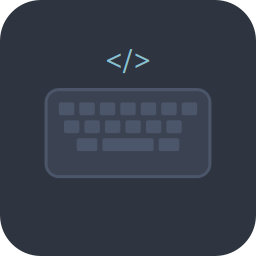

<p align="center">
  
</p>

<h1 align="center">Dev Type</h1>

<p align="center">
  <strong>A typing practice tool built specifically for developers</strong><br />
  Practice on real code. Track meaningful metrics. Race against yourself.
</p>


---

## 🎯 Why Dev Type?

Most typing tutors are designed for general text—essays, articles, random words. But developers need something different. You don't type prose; you type **code**. Brackets, semicolons, camelCase, snake_case, nested indentation, and language-specific syntax patterns.

**Dev Type** is built for this reality. Practice on your actual projects, not artificial snippets. Point it at your codebase, pick a file, and start typing. Simple, focused, effective.

---

## 🎬 See It In Action

<table>
  <tr>
    <td width="50%">
      <video src="assets/videos/compressed_practice_on_file_file_of_your_choosing.mp4" width="100%" controls muted loop style="border-radius: 8px;"></video>
      <p align="center"><sub><b>Practice on any file from your projects</b></sub></p>
    </td>
    <td width="50%">
      <video src="assets/videos/compressed_race_against_your_best_time.mp4" width="100%" controls muted loop style="border-radius: 8px;"></video>
      <p align="center"><sub><b>Race against your best performance</b></sub></p>
    </td>
  </tr>
  <tr>
    <td width="50%">
      <video src="assets/videos/compressed_themes.mp4" width="100%" controls muted loop style="border-radius: 8px;"></video>
      <p align="center"><sub><b>Multiple beautiful themes included</b></sub></p>
    </td>
    <td width="50%">
      <video src="assets/videos/compressed_stats.mp4" width="100%" controls muted loop style="border-radius: 8px;"></video>
      <p align="center"><sub><b>Deep analytics and visualizations</b></sub></p>
    </td>
  </tr>
</table>

---

## 📸 Screenshots

<table>
  <tr>
    <td width="50%">
      
      <p align="center"><sub><b>Clean, distraction-free typing interface</b></sub></p>
    </td>
    <td width="50%">
      
      <p align="center"><sub><b>Manage multiple project folders</b></sub></p>
    </td>
  </tr>
  <tr>
    <td width="50%">
      
      <p align="center"><sub><b>Browse files by programming language</b></sub></p>
    </td>
    <td width="50%">
      
      <p align="center"><sub><b>Complete session history with detailed metrics</b></sub></p>
    </td>
  </tr>
  <tr>
    <td width="50%">
      
      <p align="center"><sub><b>Visual analytics with heatmaps and charts</b></sub></p>
    </td>
    <td width="50%">
      
      <p align="center"><sub><b>Extensive customization options</b></sub></p>
    </td>
  </tr>
</table>

---

## ✨ Features

### 📂 Practice on Real Code
- **Your Projects, Your Files**: Point Dev Type at any folder on your machine
- **Smart Filtering**: Automatically ignores binaries, dependencies (`node_modules`, `venv`, etc.)
- **Large Codebase Support**: Optimized to handle folders with thousands of files without performance degradation
- **Random File Selection**: Jump to a random file with `Ctrl+R` for variety

### 👻 Ghost Racing System
- **Compete Against Yourself**: Every completed session creates a "ghost" of your best performance
- **Real-Time Comparison**: See your ghost's position as you type
- **Automatic Recording**: Only your fastest run per file is saved
- **Visual Feedback**: Clear indicators show when you're ahead or behind

### 📊 Advanced Analytics
- **Beyond WPM**: Track accuracy, error patterns, and consistency over time
- **Keyboard Heatmap**: Visualize which keys you use most frequently
- **Confusion Matrix**: Identify your most problematic key combinations
- **Progress Tracking**: Charts and graphs showing improvement trends
- **Session History**: Complete log of every practice session

### 💀 Instant Death Mode
- **Zero Tolerance**: One mistake and the session ends
- **Perfect Practice**: Forces 100% accuracy over speed
- **Muscle Memory**: Build flawless typing habits for complex syntax

### 👥 Multi-Profile Support
- **Isolated Profiles**: Separate stats for different users or keyboard layouts
- **Profile Switching**: Quick switching with visual transitions
- **Independent Settings**: Each profile maintains its own preferences

### ⏸️ Smart Session Management
- **Auto-Pause**: Timer stops automatically after a few seconds of inactivity
- **Resume Anywhere**: Close the app and pick up exactly where you left off
- **Progress Persistence**: All data saved locally in SQLite
- **Large File Support**: Handle files with thousands of lines without performance issues

### 🎨 Customization
- **Multiple Themes**: Choose from Nord, Dracula, Gruvbox, Cyberpunk, and more
- **Font Options**: Select your preferred coding font and size
- **Color Schemes**: Customize text colors for untyped, correct, and incorrect characters
- **Cursor Styles**: Multiple cursor types and animations
- **Sound Effects**: Optional typing sounds with volume control

### ⌨️ Keyboard-First Design
- **Extensive Shortcuts**: Navigate without touching the mouse
- **Smart Indent**: Automatic indentation handling for nested code blocks
- **Word Deletion**: `Ctrl+Backspace` to delete entire words
- **Quick Navigation**: Jump between tabs with `Alt+1` through `Alt+7`
- **Theme Cycling**: `Ctrl+T` to quickly switch themes
- **Search Focus**: `Ctrl+F` to focus the search bar on tabs that have one

### 🔒 Privacy & Portability
- **100% Local**: No cloud services, no accounts, no tracking
- **Portable Data**: All settings and stats in a single `Dev_Type_Data` folder
- **Easy Backup**: Copy the data folder to move between machines
- **Open Source**: Full transparency—inspect the code yourself

---

## 📥 Downloads

Ready to improve your typing? Download the latest release:

**👉 [Download Latest Release](https://github.com/mehad605/dev_type/releases/latest)**

- **Windows**: `dev_type_vX.Y.Z.exe` (Portable, no installation required)
- **Linux**: `dev_type_vX.Y.Z.deb` (Debian/Ubuntu package)

---

## 🚀 Quick Start

### Option 1: Download Binary (Easiest)
1. Download the appropriate binary for your OS from the [releases page](https://github.com/mehad605/dev_type/releases/latest)
2. Run the executable (Windows) or install the package (Linux)
3. Click "Add Folder" and select a project directory
4. Start typing!

### Option 2: Run from Source

**Prerequisites**: Python 3.13+, Git

#### Using uv (Recommended)

*Don't have uv?* Install it from the [official guide](https://docs.astral.sh/uv/getting-started/installation/).

```bash
git clone https://github.com/mehad605/dev_type.git
cd dev_type
uv sync
uv run main.py
```

#### Using pip
```bash
git clone https://github.com/mehad605/dev_type.git
cd dev_type
python -m venv .venv

# Activate virtual environment:
# Windows: .venv\Scripts\activate
# Linux/macOS: source .venv/bin/activate

pip install .
python main.py
```

---

## 🛠️ Building from Source

### Windows (.exe)
```bash
uv run python build.py --windows --clean
```
Output: `dist/dev_type_vX.Y.Z.exe`

### Linux (.deb)
```bash
chmod +x build.sh
./build.sh
```
Or manually:
```bash
uv run python build.py --linux --clean
```
Output: `dist/dev_type_vX.Y.Z.deb`

Install with: `sudo apt install ./dist/dev_type_vX.Y.Z.deb`

---

## 🧪 Testing

We maintain a comprehensive test suite with 500+ tests covering all major functionality.

```bash
# Run all tests
uv run pytest

# Run with coverage report
uv run pytest --cov=app --cov-report=html

# Run specific test file
uv run pytest tests/test_typing_engine.py
```

For detailed testing documentation, see [docs/TESTS.md](docs/TESTS.md).

---

## 🎮 Command Line Flags

Dev Type supports various CLI flags for advanced usage:

```bash
# Start with a specific profile
python main.py --profile "Work"

# Enable instant death mode by default
python main.py --instant-death

# Start with sound disabled
python main.py --sound-off
```

For a complete list of flags, see [docs/CLI_FLAGS.md](docs/CLI_FLAGS.md).

---

## 🤝 Contributing

Dev Type is an hobby project built with passion for the developer community. Contributions are welcome!

### Ways to Contribute
- **⭐ Star the Repository**: Help others discover the project
- **🐛 Report Bugs**: Open an issue if you find something broken
- **💡 Suggest Features**: Share your ideas for improvements
- **📝 Improve Documentation**: Help make the docs clearer
- **🔧 Submit Pull Requests**: Fix bugs or add features

### Development Setup
1. Fork the repository
2. Create a feature branch: `git checkout -b feature/amazing-feature`
3. Make your changes
4. Run tests: `uv run pytest`
5. Commit your changes: `git commit -m 'Add amazing feature'`
6. Push to the branch: `git push origin feature/amazing-feature`
7. Open a Pull Request

---

## 💬 Community & Support

- **Issues**: [GitHub Issues](https://github.com/mehad605/dev_type/issues)
- **Discussions**: [GitHub Discussions](https://github.com/mehad605/dev_type/discussions)

---

## 📄 License

**Creative Commons Attribution-NonCommercial-ShareAlike 4.0 International (CC BY-NC-SA 4.0)**

You are free to:
- ✅ **Share**: Copy and redistribute the material
- ✅ **Adapt**: Remix, transform, and build upon the material
- ✅ **Learn**: Study the code and use it for educational purposes

Under the following terms:
- **Attribution**: Give appropriate credit
- **NonCommercial**: Not for commercial use
- **ShareAlike**: Distribute derivatives under the same license

[Read Full License](LICENSE)

---


<div align="center">

### ⭐ If you find Dev Type useful, please consider giving it a star!

**It helps other developers discover the project and motivates continued development.**


</div>

---

<p align="center">
  Made with ❤️ for developers who care about their craft
</p>
