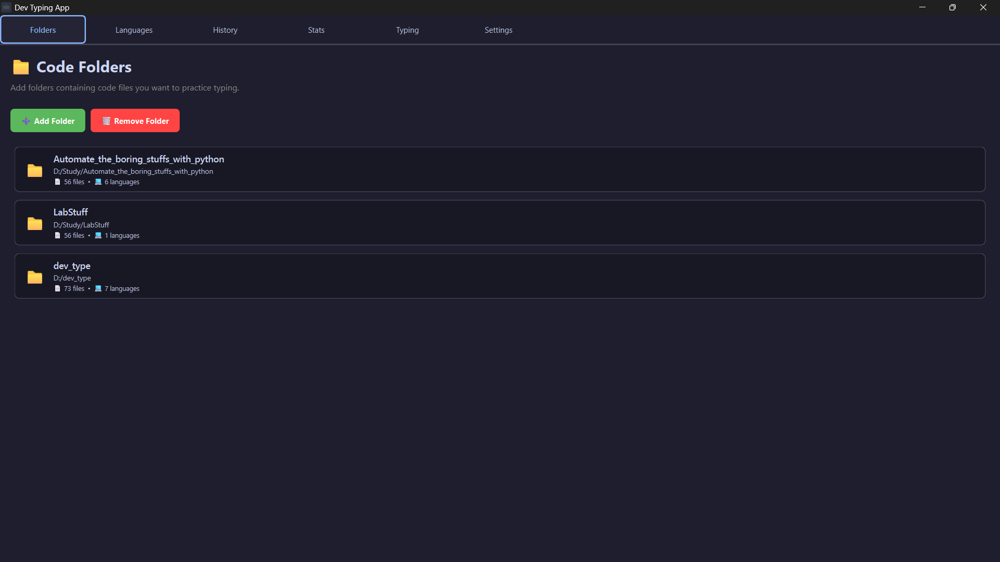
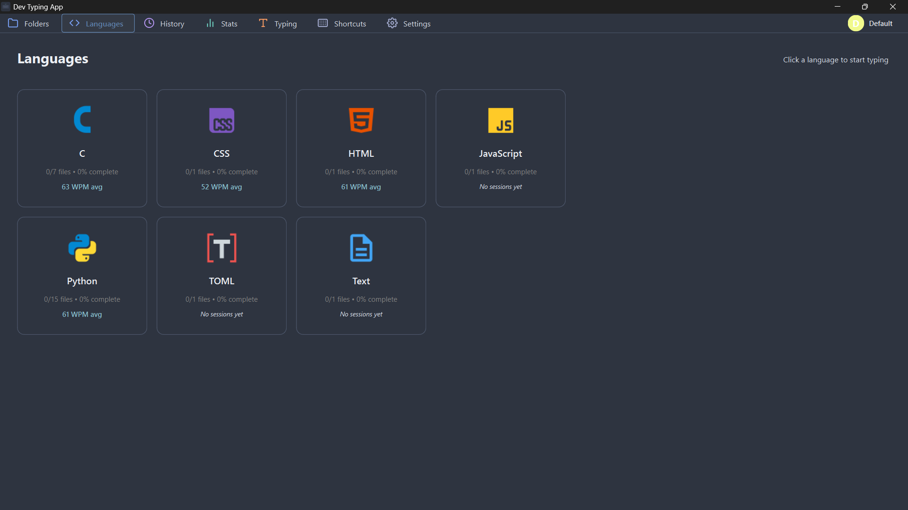
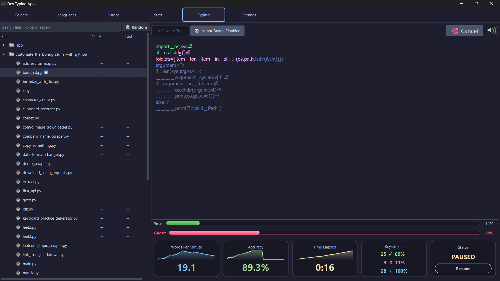
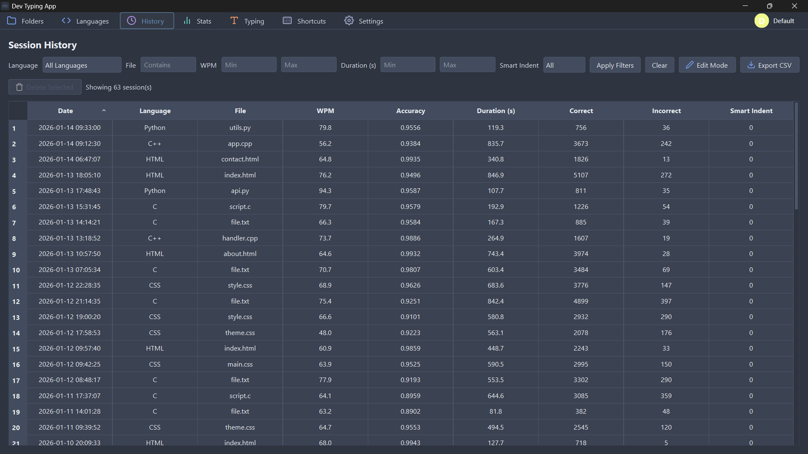
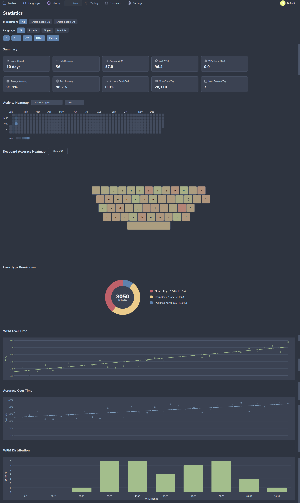
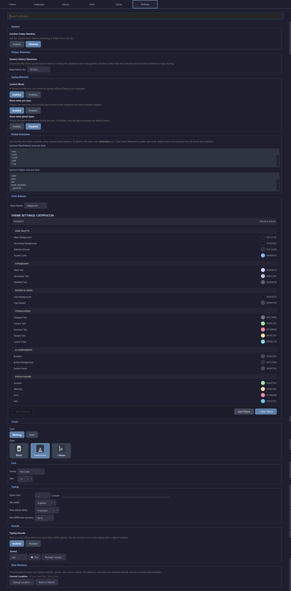

<div align="center">
  
  <h1>Dev Type</h1>
  <p>
    <strong>The uncompromising typing app for developers.</strong>
  </p>
</div>

---

<div align="center">
  <video src="https://github.com/user-attachments/assets/ef18ab02-c152-4711-a8ab-fa79f8841734" width="70%" controls muted autoplay loop style="border-radius: 8px; box-shadow: 0 10px 30px rgba(0,0,0,0.5);"></video>
</div>

<br />

### Why Dev Type?

Most typing tutors treat you like a secretary from 1995. They feed you random paragraphs of prose or nonsensical dictionary words.

**You are a developer.** You type syntax, brackets, camelCase, snake_case, and complex indentation patterns. 

**Dev Type** is different. It's a local-first, high-performance desktop app that lets you practice on **your own code**. Point it at your project folder, pick a file, and start racing.

If you enjoy the project, please consider giving it a star! 🌟

---

## 📸 Gallery

| **Folders Layout** | **Languages Overview** |
| :---: | :---: |
|  |  |

| **Typing Interface** | **Session History** |
| :---: | :---: |
|  |  |

| **Detailed Statistics** | **Extensive Settings** |
| :---: | :---: |
|  |  |

---

## ✨ Features

### 📁 Your Code, Your Practice
Don't type random snippets. `File > Open Folder`. We scan your local projects, ignore the binary junk (`.exe`, `node_modules`, `venv`), and let you type the real files you work with every day.

> **Warning:** Dev Type is designed for **completed projects** or **fixed codebases**. Because ghost replays rely on exact text matching, constantly changing the file content will break your previous ghost records. If you must edit the file, the ghost functionality for that specific file will be disabled until you reset.

### 📊 Deep Statistics
Go beyond WPM. We track your accuracy, key-by-key confusion matrix (which keys you miss most), and even generate a **keyboard heatmap** of your typing patterns.

### ⏸️ Portable & Resumable
- **Portable Data**: All your stats and profiles live in the `Dev_Type_Data` folder next to the app. Moving machines? Just copy the folder.
- **Auto-Pause**: Get interrupted? The app auto-pauses after a few seconds of inactivity. You can close the app and resume a 5,000-line file explicitly where you left off next week. Data is always safe.

### 👻 Race Your Best Ghost
Push your limits by racing against your own best performance. We automatically save only your **fastest run** for each file, letting you compete against your peak efficiency.

### 💀 Instant Death Mode
For the perfectionists. One mistake and it's game over. Reset to the top. This high-stakes mode forces you to slow down and prioritize 100% accuracy over raw speed.

### ⌨️ Keyboard Shortcuts
Keep your hands on the home row. We support extensive keyboard shortcuts for navigation and control:
- `Esc`: Reset cursor to top of file
- `Ctrl + R`: Random file from current view
- `Ctrl + T`: Cycle through themes
- `Ctrl + P`: Toggle Pause/Resume
- `Ctrl + Backspace`: Delete word

### 🧠 Smart Indent Logic
Simulates IDE behavior while respecting the constraints of typing drills. Since backspacing out of a deep nested block isn't visually viable when tracing pre-written code, our smart indent automatically handles level jumps for you, keeping the flow seamless.

### 👥 Multi-Profile Support
Share the app without mixing your stats. Create separate profiles for yourself, your family members, or even different keyboard layouts (e.g., "QWERTY" vs "Colemak"). Every profile gets its own isolated history, settings, and progress.

### 🔒 Privacy First
No cloud. No login. No tracking. Your speed stats, your history, and your code stay on your machine. All data is stored in a local SQLite database that you control.

---

## 📥 Downloads

If you just want to use the app, download the standalone binaries:

👉 **[Download Latest Release](https://github.com/mehad605/dev_type/releases/latest)**

- **Windows**: `dev_type_vX.Y.Z.exe` (Portable executable)
- **Linux**: `dev_type_vX.Y.Z.deb` (Debian/Ubuntu package)

---

## 🚀 Development

### CLI Flags
The app supports various command-line flags for advanced usage or debugging.
```bash
# Example usage:
python main.py --profile "Work" --instant-death --sound-off
```
Common flags:
- `--profile`: Start with a specific profile loaded
- `--instant-death`: Force enable instant death mode
- `--sound-off`: Start with sound disabled

For a complete list, see [docs/CLI_FLAGS.md](docs/CLI_FLAGS.md).

### Tests
We have a comprehensive test suite. If you are contributing, please check [docs/TESTS.md](docs/TESTS.md) for detailed information on how to run and interpret the tests.

### Setup
If you want to modify the code or run the latest development version:

**Prerequisites:** Python 3.13+, Git

#### Using uv (⭐ Recommended)
*Don't have uv?* [Install it here](https://docs.astral.sh/uv/getting-started/installation/).

1. **Clone & Enter:**
   ```bash
   git clone https://github.com/mehad605/dev_type.git
   cd dev_type
   ```
2. **Setup & Run:**
   ```bash
   uv sync
   uv run main.py
   ```

#### Using standard pip
1. **Clone & Enter:**
   ```bash
   git clone https://github.com/mehad605/dev_type.git
   cd dev_type
   ```
2. **Create Virtual Environment:**
   ```bash
   python -m venv .venv
   # Windows: .venv\Scripts\activate
   # Linux/macOS: source .venv/bin/activate
   ```
3. **Install & Run:**
   ```bash
   pip install .
   python main.py
   ```

---

## 📦 Building from Source

You can generate your own standalone binaries using the included build system.

### 🪟 Windows (.exe)
Double-click `build.bat` or run:
```bash
uv run python build.py --windows --clean
```
The output will be a portable executable in the `dist/` folder named `dev_type_vX.Y.Z.exe`.

### 🐧 Linux (.deb)
Run the build script:
```bash
chmod +x build.sh
./build.sh
```
Or manually:
```bash
uv run python build.py --linux --clean
```
This will generate a Debian package `dev_type_vX.Y.Z.deb` in the `dist/` folder, which can be installed via `sudo apt install ./dist/dev_type_vX.Y.Z.deb`.

---

## 📄 License & Philosophy

**CC BY-NC-SA 4.0**

TL;DR:
*   **Hack on it.** (Go wild)
*   **Share it.** (With friends, enemies, your cat)
*   **Learn from it.** (It's 100% open source)
*   **Keep it free.** (No selling, please)

[Read Full License](LICENSE)
